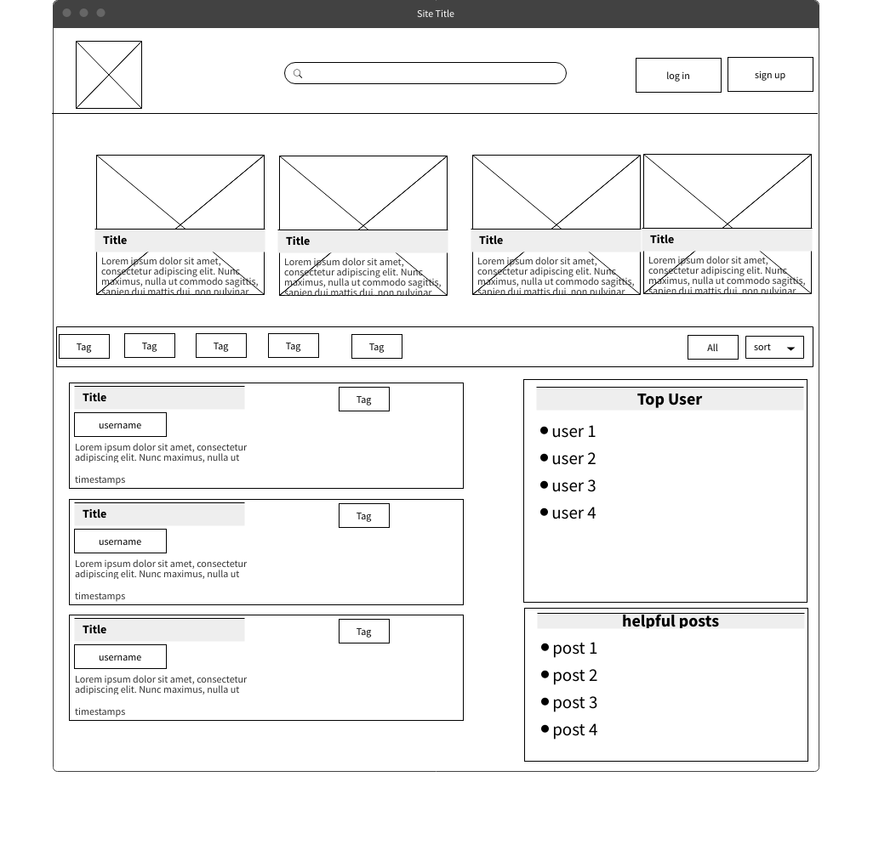
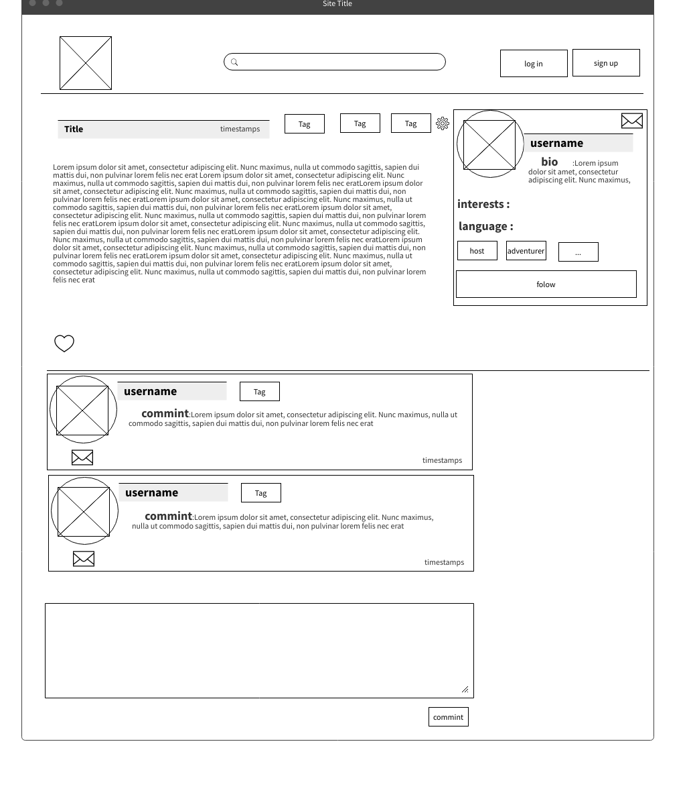
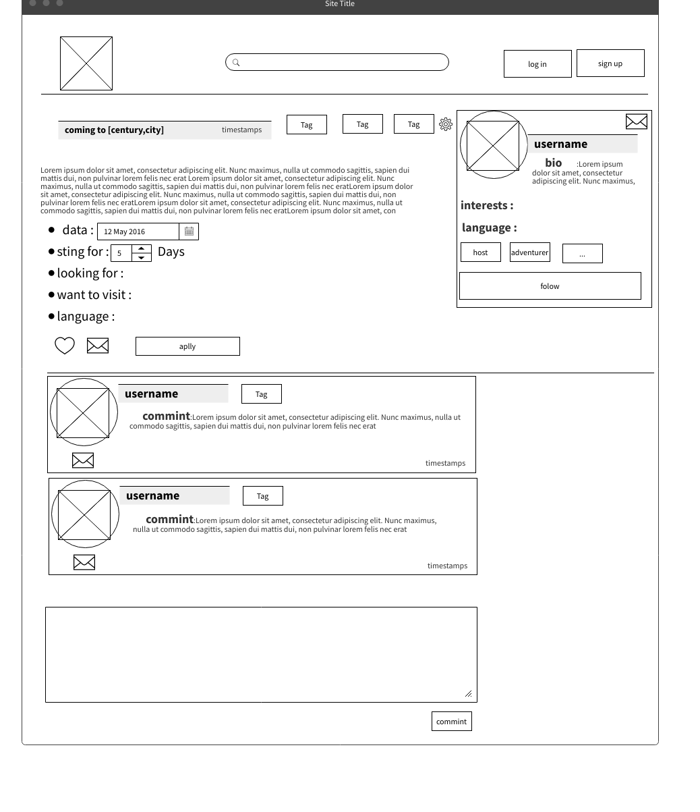
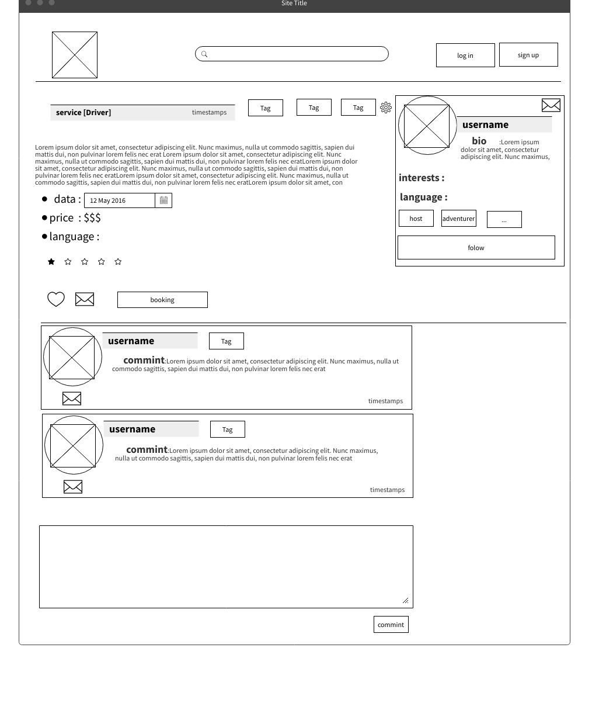
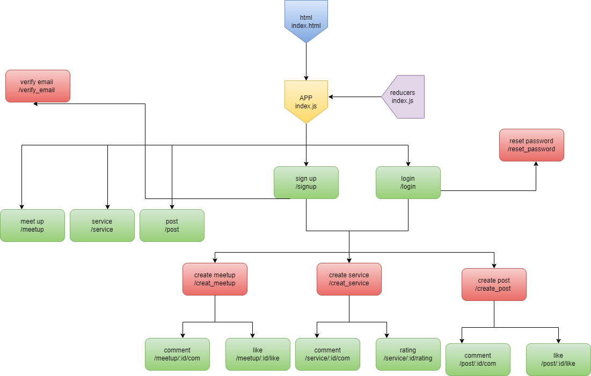

## Master Paece Project (Name)

(Name):the app focus on traveling and cultural exchange to make it essayer for the Tourists
to konw and the touristic places and historical places from Residents of the area ,
so the user can Post on the app his destination and ask about : what to do and not to do ,shops for necessities ,events can vists ,Restaurants...etc.
and the other users commint on the post to help or even arrange meeting to discover the plece together and make new friends .


## User Story 

- **Signup:**  user can sign up in the platform so that the user can start posts and reply to athers posts  
- **Login:**  user can login to the platform so that the user can see his oun posts and reply to the comments on  it 
- **Logout:** As a user I can logout from the platform so no one else can use my profile 
- **Add New Posts:** As a user I can post new post
- **Commint on posts:** As a user I can comment on all posts
- **Messages:** As a user I can seand private  messages to Another user 
- **Friend:** As a user I can add user to firends list and follow thers posts

##Admin Story 
- **Deleat posts:** As a Admin I can deleat any post  
- **Deleat Commint:** As a Admin I can deleat any Commint 
- **banned  user:** As a Admin I can banned any user from commint and post 

## Getting Started

### Installing Dependencies


#### NPM Dependencies

Once you have the project in your local machine, install dependencies by running:

```bash
npm i
```

This will install all of the required packages.

##### Key Dependencies

- [React](https://reactjs.org/) A JavaScript library for building user interfaces.

- [axios](https://www.npmjs.com/package/axios) is a promise based HTTP client for the browser and node.js.

- [redux](https://www.npmjs.com/package/redux) is a predictable state container for JavaScript apps.

- [react-redux](https://www.npmjs.com/package/react-redux) is a React bindings for Redux.

- [react-icons](https://react-icons.github.io/react-icons/) Include popular icons in your React projects easily with react-icons.

- [sweetalert2](https://sweetalert2.github.io/) A Beautiful, Responsive, Customizable, Accessible (Wai-aria) Replacement For Javascript's Popup Boxes.


## Running the server

To run the server, execute:

```bash
npm start
```


# Client / Frontend

## React Router Routes (React App)

| Path             | Component            | Permissions                | Behavior                                                     |
| ---------------- | -------------------- | -------------------------- | ------------------------------------------------------------ |
| `/`              | homePage             | public `<Route>`           | Home page                                                    |
| `/signup`        | SignupPage           | public `<Route>`           | Signup form, link to login, navigate to homepage after signup|
| `/login`         | LoginPage            | public `<Route>`           | Login form, link to signup, navigate to homepage after login |
| `/posts`         | posts Page           | public `<Route>`           | Shows all posts                                              |
| `/post/create`   | create post Page     | user only `<PrivateRoute>` | create a post                                                |
| `/post/:id`      | post Page            | public `<Route>`           | read the post for all , and commint and like for useres, and edit for the owner      |
| `/meetsup`       | meets up Page        | public `<Route>`           | Shows all meets up                                           |
| `/meetup/create` | create meetup Page   | user only `<PrivateRoute>` | create a meet up                                             |
| `/meetup/:id`    | meetup Page          | public `<Route>`           | read the meet up for all , and commint ,like and aplly for useres, and edit for the owner      |
| `/services`      | services Page        | public `<Route>`           | Shows all services                                           |
| `/service/create`| create service Page  | user only `<PrivateRoute>` | create a service                                             |
| `/service/:id`   | service Page         | public `<Route>`           | read the service for all , and commint ,rate  and booking for useres, and edit for the owner   |
| `/profile/:id`   | service Page         | public `<Route>`           | read for all , and edit for the owner                        |

## Components
- HomePage
- PostPage
- MeetupPage
- ServicePage
- LoginPage
- ProfilePage
- SignupPage
- Comment
- like
- search
- Navbar

## Links
### Trello
[Link to your trello board](https://trello.com/mpprojecthaitham) 
### Git


[Client repository Link](https://github.com/MP-Project-Haitham/server)

[Server repository Link](https://github.com/MP-Project-Haitham/client)

[Deployed App Link](https://travelingroad.vercel.app)
### Slides


[Slides Link](https://github.com/MP-Project-Haitham)

### Wireframe

Home page

Post page

Meetup page

Service page 


## UML

